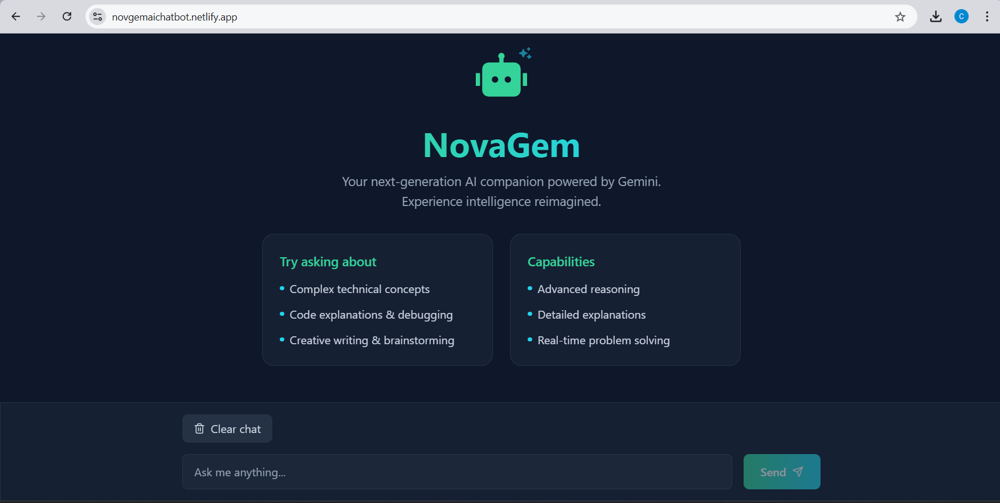

# NovaGem - AI Assistant 🤖✨

NovaGem is a modern, responsive AI chat assistant powered by Google's Gemini AI. Built with React and styled with Tailwind CSS, it offers a sleek user interface with a beautiful glass-morphism design.



## 🌟 Features

- **Real-time AI Responses**: Powered by Gemini 1.5 Flash model
- **Modern UI/UX**: Glass-morphism design with emerald-cyan gradient theme
- **Markdown Support**: Full markdown rendering including code syntax highlighting
- **Responsive Design**: Works seamlessly on desktop and mobile devices
- **Code Highlighting**: Built-in syntax highlighting for code snippets
- **Chat History**: Maintain conversation history with clear chat option

## 🚀 Getting Started

### Prerequisites

- Node.js (v14 or higher)
- npm or yarn
- Google Gemini API key

### Installation

1. Clone the repository:
```bash
git clone https://github.com/itz-shakil-92/AI-ChatBot-NovaGem.git
```

2. Install dependencies:
```bash
npm install
```

3. Create a `.env` file in the root directory and add your Gemini API key:
```env
VITE_GEMINI_API_KEY=your-api-key-here
```

4. Start the development server:
```bash
npm run dev
```

5. Open [http://localhost:5173](http://localhost:5173) to view it in your browser.

## 🛠️ Built With

- [React](https://reactjs.org/) - Frontend framework
- [Vite](https://vitejs.dev/) - Build tool
- [Tailwind CSS](https://tailwindcss.com/) - Styling
- [Google Gemini AI](https://deepmind.google/technologies/gemini/) - AI model
- [React Markdown](https://github.com/remarkjs/react-markdown) - Markdown rendering
- [React Syntax Highlighter](https://github.com/react-syntax-highlighter/react-syntax-highlighter) - Code highlighting

## 📝 Environment Variables

The following environment variables are required:

| Variable | Description |
|----------|-------------|
| `VITE_GEMINI_API_KEY` | Your Google Gemini API key |

## 🎨 Features

### Chat Interface
- Clean and intuitive chat interface
- Real-time message updates
- Loading indicators
- Clear chat functionality
- Code syntax highlighting
- Markdown support

### UI/UX
- Glass-morphism design
- Gradient accents
- Responsive layout
- Smooth animations
- Dark theme
- Custom scrollbar

## 🤝 Contributing

Contributions are welcome! Please feel free to submit a Pull Request.

1. Fork the project
2. Create your feature branch (`git checkout -b feature/AmazingFeature`)
3. Commit your changes (`git commit -m 'Add some AmazingFeature'`)
4. Push to the branch (`git push origin feature/AmazingFeature`)
5. Open a Pull Request


## 🙏 Acknowledgments

- Google Gemini AI for providing the AI capabilities
- The React community for amazing tools and libraries
- Tailwind CSS for the utility-first CSS framework

## 📧 Contact

Shakil Kathat - [LinkedIn](https://www.linkedin.com/in/shakilkathat92/)

Project Link: [https://github.com/itz-shakil-92/AI-ChatBot-NovaGem.git](https://github.com/itz-shakil-92/AI-ChatBot-NovaGem.git)